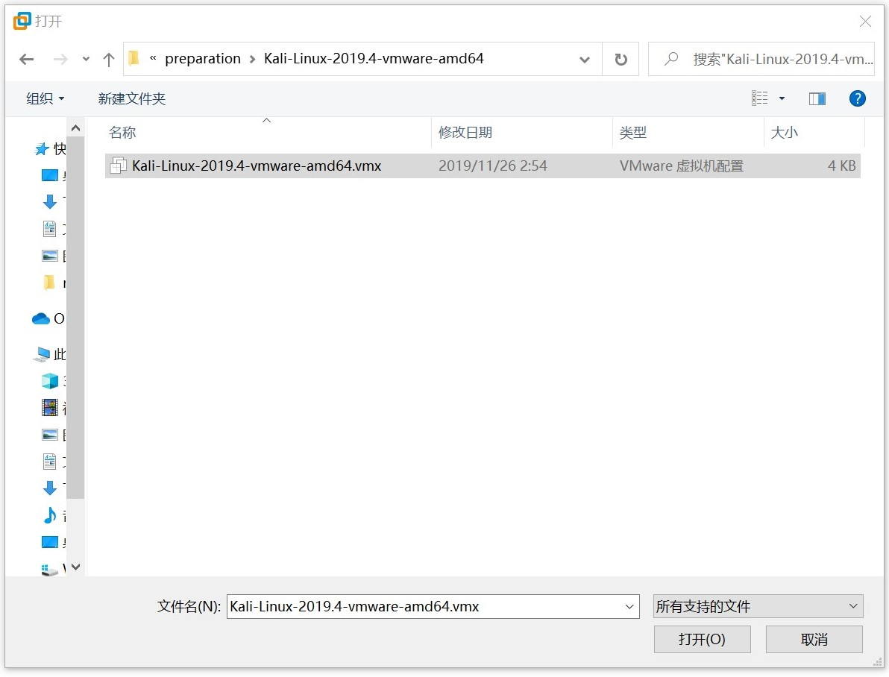
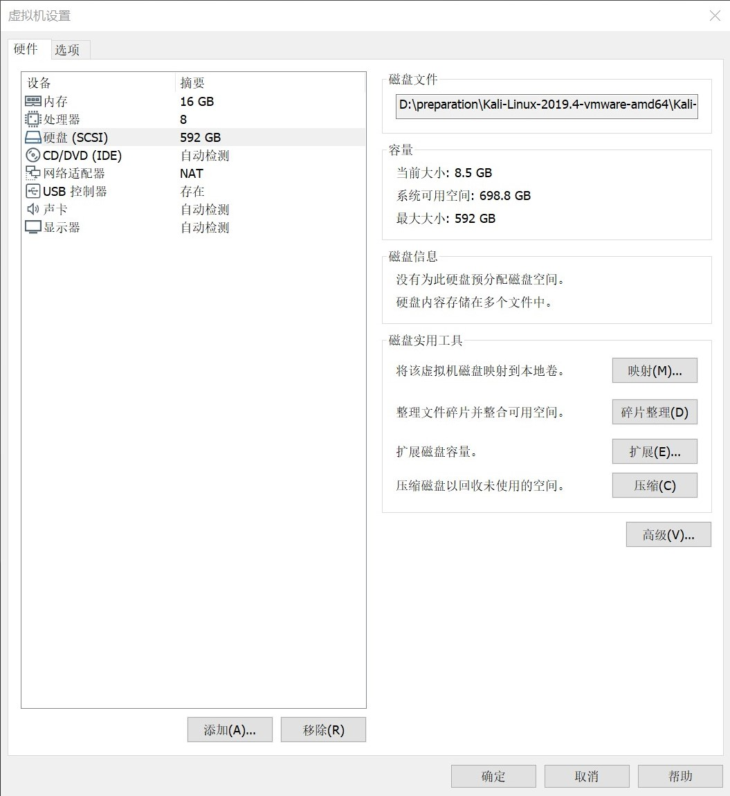
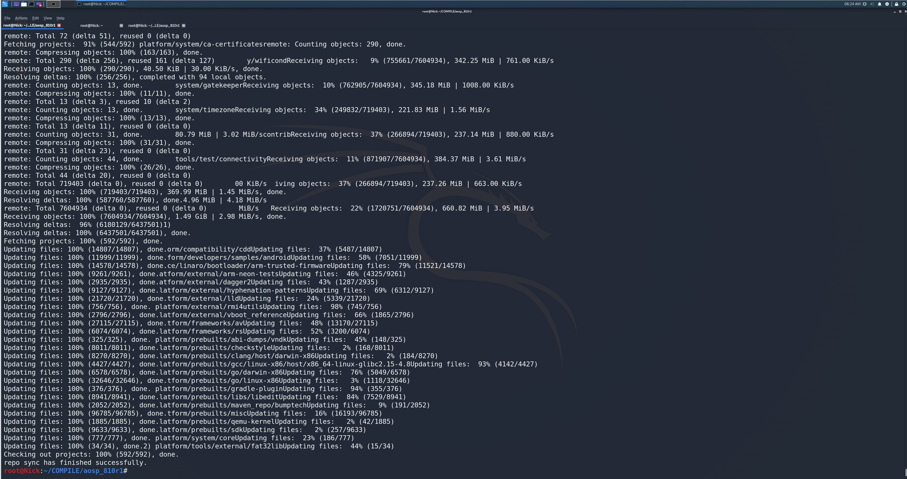
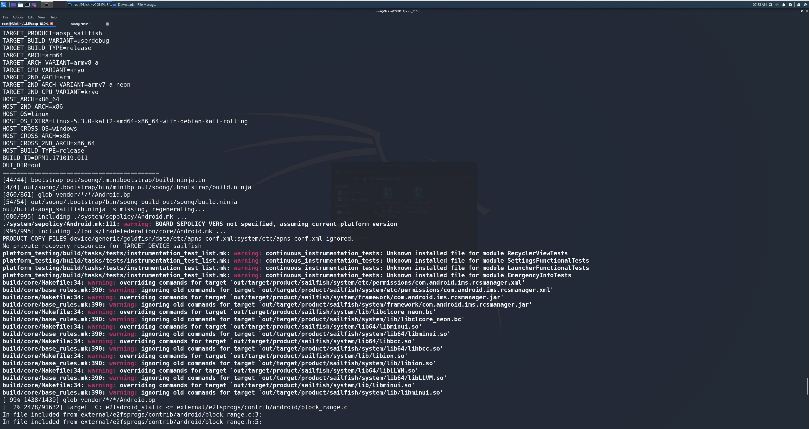
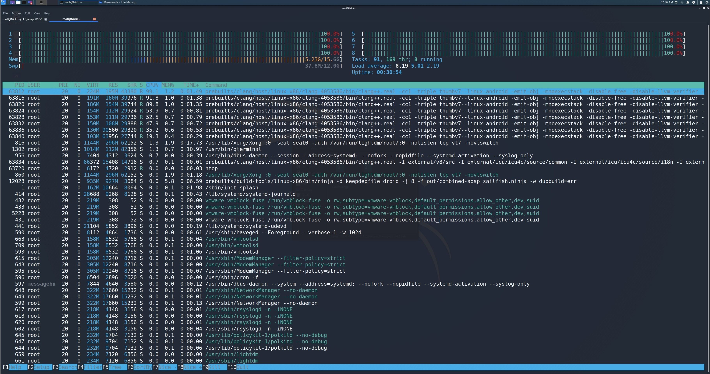
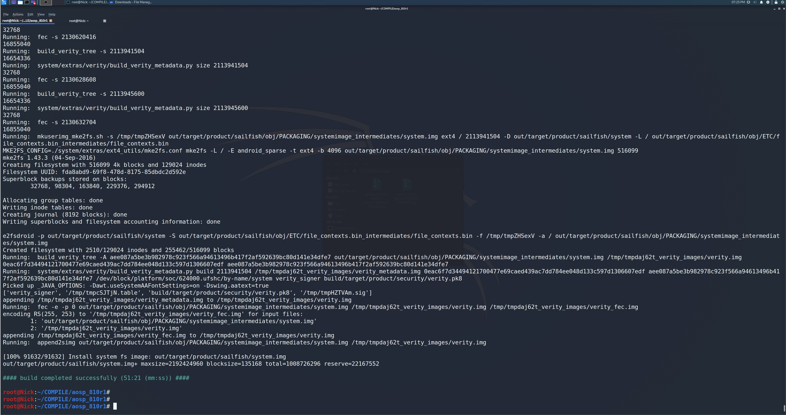
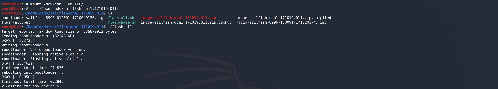
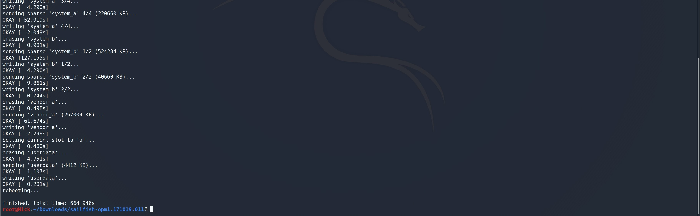
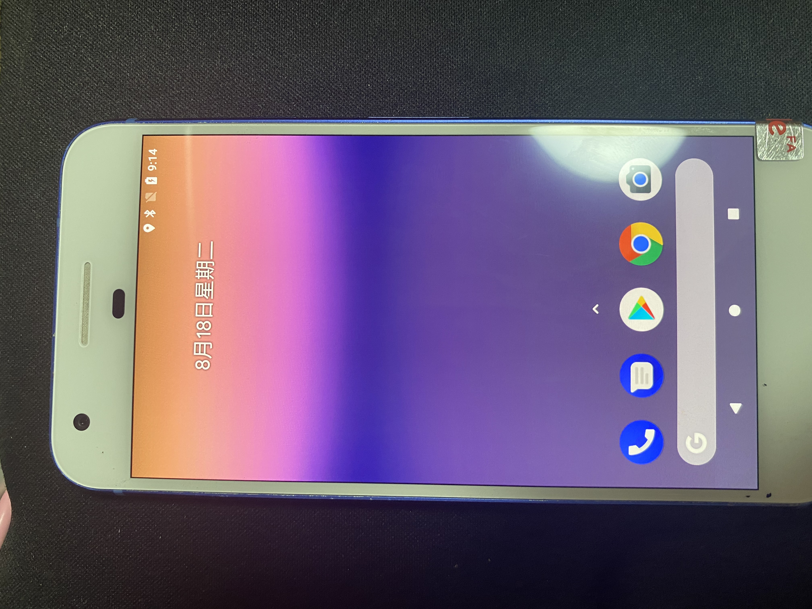
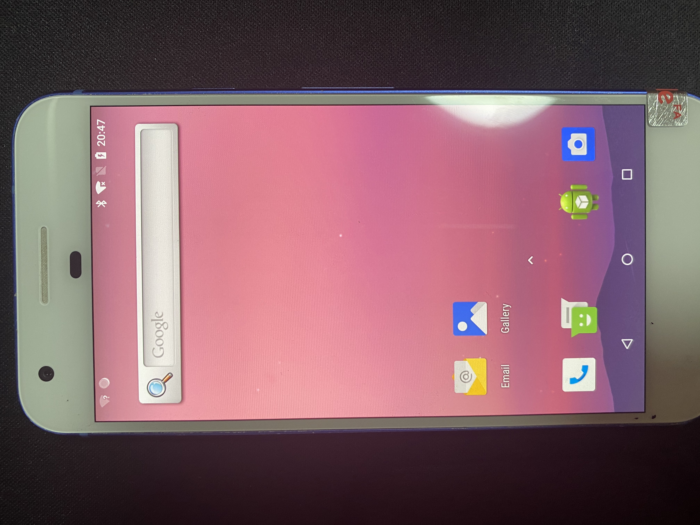

一篇文章搞定全套Android安全入门环境
=================================


## 0. 致谢

最近跟着r0ysue入坑了Android逆向，然后准备出一系列从陈总这边py来全套的手摸手学习笔记。群里每天很开心也很热闹，欢迎大家一起来开车（噢不，是来玩哈哈。


[如果不想折腾可以直接到网盘拿配置完的虚拟机镜像以及这篇文章中你需要的东西 提取码：wale](https://pan.baidu.com/s/1z1kllkZFz4aIskyXJqyCcA)


## 1. 硬件配置

入门 **Android移动安全** 第一步，就是配置一套无痛的环境，首先是硬件配置如下：


1. 一台16G内存+512G固态的电脑(全程操作在kali下，物理机可以为任意操作系统)
    + [VMware Workstation Pro](https://www.vmware.com/go/getworkstation-win)
        - [kali-linux-2019-4-vmware-amd64](http://old.kali.org/kali-images/kali-2019.4/)

2. [一台sailfish手机](https://wiki.lineageos.org/devices/sailfish)


## 2. 解压一个全新的kali虚拟机

**开发请远离Windows，跟着肉湿傅使用kali可以少踩坑何乐而不为呢？**

1. 解压下载的kali虚拟机
2. 打开kali虚拟机: vmware - 文件 - 打开

3. 修改kali虚拟机相关配置
    + 内存
        - 16G(16384MB)
    + 处理器
        - 8核：4 * 2
    + 硬盘
        - 拓展 - 592 (默认80G + 用于编译的512G) - 拓展 - 确定
    + 显示器
        - 取消勾选 加速3D图形
    
4. 开启此虚拟机 - 我已复制该虚拟机
5. 登录kali - 用户名 root / 密码 toor
6. 自行设置terminal字体大小和Unlimited history，关闭Power Manager - Display - 三个选项全部设置Never，右上角按钮关闭


## 3. 初始化一些kali的基本配置

```bash
# 打开terminal依次顺序执行如下命令:

vim /etc/hostname

修改kali为Nick


# 修改vim键位映射
vim ~/.vimrc

# 输入如下三行内容，这样vim退出就要使用jk而不是Esc了（个人习惯
" keyboard mapping
inoremap jk <Esc>
inoremap <Esc> <nop>


# 更新源并且安装一些常用工具，安装过程中跳出libc6:amd64选择Yes
apt update
apt install htop jnettop nethogs openssh-server tree tmux -y


# 修改ssh配置
vim /etc/ssh/sshd_config

# 找到如下三行添加或修改
PubkeyAuthentication yes
PasswordAuthentication yes
PermitRootLogin yes


# 重启ssh服务并配置开机启动，查看ssh服务状态
systemctl restart ssh
systemctl enable ssh
systemctl status ssh


# 查看物理机ip
ifconfig

# 查看eth0的ip，一般为192.168.x.y


vim /etc/proxychains.conf

# 修改sock4为物理机ip(一般为192.168.x.1)，端口设置为科学上网的端口，注释掉proxy_dns，否则可能导致如下报错
# Fatal: You must get working getaddrinfo() function.
#        or you can specify "--disable-ipv6"

# proxy_dns
socks5  192.168.x.1 10808


# 配置时区
dpkg-reconfigure tzdata


# 安装中文字体，但千万千万不要把系统设置为中文!!!
apt install xfonts-intl-chinese ttf-wqy-microhei -y

```


## 4. 同步并且编译一套AOSP环境

为了方便之后对于aosp的整套工具链的使用以及对源码的修改，我们选择的是[android-8.1.0_r1/OPM1.171019.011](https://source.android.com/setup/start/build-numbers)的一套和sailfish配套的环境。


### 4.1 同步源码

可以选择直接同步源码或者使用我制作的源码包二选一即可


#### 4.1.1 直接同步源码并制作源码包

- [南方使用中科大](https://lug.ustc.edu.cn/wiki/mirrors/help/aosp)
- [北方使用清华](https://mirrors.tuna.tsinghua.edu.cn/help/AOSP/)

我们通过[中科大AOSP源](https://lug.ustc.edu.cn/wiki/mirrors/help/aosp/#%E5%88%9D%E5%A7%8B%E5%90%8C%E6%AD%A5%E6%96%B9%E6%B3%952)的初始同步方法2来同步源码

```bash
# 分区挂载额外的512G磁盘:
Windows键 - GParted - New - Add - Apply - Apply - Close


# fdisk -l 显示一个512G的/dev/sda3


# 在家目录创建文件夹并且挂载
root@Nick:~# mkdir COMPILE
root@Nick:~# mount /dev/sda3 COMPILE/


# 安装源码同步工具repo
root@Nick:~# mkdir -p ~/COMPILE/repo_utility/bin
root@Nick:~# PATH=~/COMPILE/repo_utility/bin:$PATH
root@Nick:~# curl -sSL  'https://gerrit-googlesource.proxy.ustclug.org/git-repo/+/master/repo?format=TEXT' |base64 -d > ~/COMPILE/repo_utility/bin/repo
root@Nick:~# chmod a+x ~/COMPILE/repo_utility/bin/repo


root@Nick:~# cd COMPILE/
root@Nick:~/COMPILE# mkdir aosp_810r1
root@Nick:~/COMPILE# cd aosp_810r1/


## 如果提示无法连接到 gerrit.googlesource.com，可以编辑 ~/COMPILE/repo_utility/bin/repo，把 REPO_URL 一行替换成下面的：
## REPO_URL = 'https://gerrit-googlesource.proxy.ustclug.org/git-repo'
## REPO_URL = 'https://mirrors.tuna.tsinghua.edu.cn/git/git-repo'
vim ~/COMPILE/repo_utility/bin/repo

修改 REPO_URL = 'https://gerrit-googlesource.proxy.ustclug.org/git-repo' 或者 REPO_URL='https://mirrors.tuna.tsinghua.edu.cn/git/git-repo'


root@Nick:~/COMPILE/aosp_810r1# git config --global user.email "nick@nick.com"
root@Nick:~/COMPILE/aosp_810r1# git config --global user.name "nick"


# 下面同步源码二选一，视网络状况决定
# 可能出现颜色选择 - 选 y
# 1. 中科大同步源码
root@Nick:~/COMPILE/aosp_810r1# repo init -u git://mirrors.ustc.edu.cn/aosp/platform/manifest -b android-8.1.0_r1

root@Nick:~/COMPILE/aosp_810r1# repo sync

# 2. 清华同步源码
root@Nick:~/COMPILE/aosp_810r1# repo init -u https://mirrors.tuna.tsinghua.edu.cn/git/AOSP/platform/manifest -b android-8.1.0_r1

root@Nick:~/COMPILE/aosp_810r1# repo sync

# 这边可以另开一个jnettop观察速度，如果假死了可以Ctrl + C取消后重新 repo sync
# 显示repo sync has finished successfully.则大功告捷
# du -hs .repo/ 显示38G


# 制作源码包
root@Nick:~/COMPILE/aosp_810r1# rm -rf .repo/
root@Nick:~/COMPILE/aosp_810r1# cd ..
# 删除.repo后文件夹aosp_810r1大概31G
root@Nick:~/COMPILE# du -hs aosp_810r1/
root@Nick:~/COMPILE# 7z a aosp_810r1.7z aosp_810r1/

# 压缩得到的源码包 aosp_810r1.7z 大约11G md5为 134725c2ff68fdde450c7428203b1190
```




#### 4.1.2 解压源码包获取源码

```bash
# 注意和aosp_810r1.7z.md5比对一定要一致
# md5是 134725c2ff68fdde450c7428203b1190再继续后面的解压以及编译
root@nick:~/COMPILE# md5sum aosp_810r1.7z
# 解压源码包
root@nick:~/COMPILE# 7z x aosp_810r1.7z
# 解压源码包路径冲突 选择A
# 解压结束会报错 Sub items Errors: 1 / Archives with Errors: 1 / Sub items Errors: 1
# 如果是 1 1 1的话是成功的,是7z压缩导致的小bug
```


### 4.2 编译AOSP8.1.0_r1

[下载sailfish的810r1版本的Google和Qualcomm驱动文件](https://developers.google.com/android/drivers#sailfishopm1.171019.011)

```bash
root@Nick:~# cd ~/COMPILE/aosp_810r1/
root@Nick:~/COMPILE/aosp_810r1# apt update


# 如果之前没有设置git需要设置一下，若之前已经设置可以跳过
root@Nick:~/COMPILE/aosp_810r1# git config --global user.email "nick@nick.com"
root@Nick:~/COMPILE/aosp_810r1# git config --global user.name "nick"


# 安装编译所需工具集
root@Nick:~/COMPILE/aosp_810r1# apt install bison tree -y
root@Nick:~/COMPILE/aosp_810r1# dpkg --add-architecture i386
root@Nick:~/COMPILE/aosp_810r1# apt update
# 下面这步不要-y，有时候会弹出对话框需要设置并且可能会报错
# E: Could not configure 'libc6:i386'. 
# E: Could not perform immediate configuration on 'libgcc-s1:i386'. Please see man 5 apt.conf under APT::Immediate-Configure for details. (2)
root@Nick:~/COMPILE/aosp_810r1# apt install libc6:i386 libncurses5:i386 libstdc++6:i386
# 如果报错的话再次执行 apt install libc6:i386 libncurses5:i386 libstdc++6:i386
root@Nick:~/COMPILE/aosp_810r1# apt install libxml2-utils openjdk-8-jdk -y


# 下载设备驱动 google_devices-sailfish-opm1.171019.011-f3bafc8b.tgz, qcom-sailfish-opm1.171019.011-247af472.tgz 到 Downloads， 不刷驱动的话可能没法开机,但新手机有时候可以成功(新手机对硬件兼容性更好)
root@Nick:~/COMPILE# cd ~/Downloads/
root@Nick:~/Downloads# tar -xvf google_devices-sailfish-opm1.171019.011-f3bafc8b.tgz 
root@Nick:~/Downloads# tar -xvf qcom-sailfish-opm1.171019.011-247af472.tgz
root@Nick:~/Downloads# mv extract-google_devices-sailfish.sh ~/COMPILE/aosp_810r1/
root@Nick:~/Downloads# mv extract-qcom-sailfish.sh ~/COMPILE/aosp_810r1/


# 添加10G swap
# 设置后htop可以看到12G的swap
root@Nick:~/Downloads# cd ~/COMPILE/
root@Nick:~/COMPILE# dd if=/dev/zero of=swap_compile_10g bs=1M count=10240
root@Nick:~/COMPILE# mkswap swap_compile_10g
root@Nick:~/COMPILE# swapon swap_compile_10g


# 执行驱动的shell脚本
root@Nick:~/COMPILE/aosp_810r1# bash extract-google_devices-sailfish.sh
# 输入 I ACCEPT
root@Nick:~/COMPILE/aosp_810r1# bash extract-qcom-sailfish.sh
# 输入 I ACCEPT


# 编译源码
root@Nick:~/COMPILE/aosp_810r1# source build/envsetup.sh 
root@Nick:~/COMPILE/aosp_810r1# lunch
# 输入24，即24. aosp_sailfish-userdebug
# 一般电脑有x个核心就jx
root@Nick:~/COMPILE/aosp_810r1# make -j8
# 一般看到 2% xx/91632 基本就没啥问题了


# 将编译成功的platform_tools设置到PATH
root@Nick:~/COMPILE/aosp_810r1# vim ~/.bashrc

# 添加如下三行到~/.bashrc结尾
PLATFORM_TOOLS_PATH=/root/COMPILE/aosp_810r1/out/host/linux-x86/bin
PATH=$PLATFORM_TOOLS_PATH:$PATH
export PATH

```






## 5. 刷机

[sailfish aosp8.1.0_r1 Factory Image](https://dl.google.com/dl/android/aosp/sailfish-opm1.171019.011-factory-56d15350.zip)


### 5.1 利用编译的源码制作一套纯净版本的image

```bash
# 只有aosp相关软件,连google全家桶都是没有的
root@Nick:~# cd ~/Downloads/
root@Nick:~/Downloads# 7z x sailfish-opm1.171019.011-factory-56d15350.zip
root@Nick:~/Downloads# cd sailfish-opm1.171019.011/


# 解压image-sailfish-opm1.171019.011.zip到image-sailfish-opm1.171019.011
# 删除解压的所有img并且用编译的img替换
root@Nick:~/Downloads/sailfish-opm1.171019.011# mkdir image-sailfish-opm1.171019.011
root@Nick:~/Downloads/sailfish-opm1.171019.011# cp image-sailfish-opm1.171019.011.zip image-sailfish-opm1.171019.011.zip.backup
root@Nick:~/Downloads/sailfish-opm1.171019.011# cp image-sailfish-opm1.171019.011.zip image-sailfish-opm1.171019.011
root@Nick:~/Downloads/sailfish-opm1.171019.011# cd image-sailfish-opm1.171019.011/
root@Nick:~/Downloads/sailfish-opm1.171019.011/image-sailfish-opm1.171019.011# 7z x image-sailfish-opm1.171019.011.zip
root@Nick:~/Downloads/sailfish-opm1.171019.011/image-sailfish-opm1.171019.011# rm *.img
root@Nick:~/Downloads/sailfish-opm1.171019.011/image-sailfish-opm1.171019.011# rm image-sailfish-opm1.171019.011.zip 
root@Nick:~/Downloads/sailfish-opm1.171019.011/image-sailfish-opm1.171019.011# cp /root/COMPILE/aosp_810r1/out/target/product/sailfish/*.img .
# 生成编译的image-sailfish-opm1.171019.011.zip
root@Nick:~/Downloads/sailfish-opm1.171019.011/image-sailfish-opm1.171019.011# cd ..
root@Nick:~/Downloads/sailfish-opm1.171019.011# rm image-sailfish-opm1.171019.011.zip
root@Nick:~/Downloads/sailfish-opm1.171019.011# 7z a image-sailfish-opm1.171019.011.zip ./image-sailfish-opm1.171019.011/*


# 还原为google factory image，如果要刷编译后的img只需将image-sailfish-opm1.171019.011.zip.compiled替换image-sailfish-opm1.171019.011.zip即可
root@Nick:~/Downloads/sailfish-opm1.171019.011# mv image-sailfish-opm1.171019.011.zip image-sailfish-opm1.171019.011.zip.compiled
root@Nick:~/Downloads/sailfish-opm1.171019.011# cp image-sailfish-opm1.171019.011.zip.backup image-sailfish-opm1.171019.011.zip
root@Nick:~/Downloads/sailfish-opm1.171019.011# rm -rf image-sailfish-opm1.171019.011
```


### 5.2 刷入谷歌原生镜像并且使用Magisk获取root

- 我这边准备了照片版的刷机全过程和一段自己随手录制的刷机视频，配合下面的操作步骤食用更香！
    - 图片版请解压网盘的flash_pixel.7z
    - [视频版链接](https://v.qq.com/x/page/e3140g5p34x.html?pcsharecode=uKzaKUOY)

1. 先按住 `手机音量下键` 然后同时按住 `电源键` 保持一段时间 直到出现Android机器人 进入 bootloader模式

2. usb连接kali并且在终端执行flash-all脚本

```bash
root@Nick:~# cd ~/Downloads/sailfish-opm1.171019.011/
root@Nick:~/Downloads/sailfish-opm1.171019.011# ./flash-all.sh
```

3. 弹出 < waiting for any device > 的时候可能需要手动在虚拟机上重连一下手机



4. 大约10分钟之后谷歌原生镜像就刷好了



5. 进行如下一系列手机的设置操作后关机

```bash
1. 语言选择 简体中文 - 中国 - 开始
2. 跳过 连接到移动网络 - 跳过 连接到WLAN网络 - 继续
3. 设置 正确的日期和时间 - 下一步
4. 姓名不填 - 下一步
5. 跳过 使用 Pixel Imprint解锁
6. 弹出的注意 取消 联系人和词典 - 确定
7. 设置屏幕锁定 - 输入密码 - 下一步 - 再次输入密码 - 确定
8. Google服务 关闭所有选项 - 同意
9. 想执行其他步骤吗 - 不用了

至此手机成功开机

10. 设置 - 显示 - 高级 - 休眠 - 30分钟
11. 设置 - 系统 - 关于手机 - 版本号疯狂按直到重新输入PIN码解锁 - 弹出 您现在处于开发者模式
12. 设置 - 系统 - 开发者选项 - USB调试 打开 - 是否允许USB调试 - 确定
13. 设置 - 系统 - 开发者选项 - 自动系统更新 关闭
14. 设置 - 声音 - 媒体音量 闹钟音量 铃声音量全部关闭 - 高级 - 所有提示音关闭
```

6. 同时按住 `手机音量下键` 和 `电源键` 再次进入 bootloader模式，使用下面命令进入TWRP临时recovery

```bash
root@Nick:~/Downloads# fastboot boot twrp-3.3.0-0-sailfish.img
```

7. 刷入TWRP后进行如下操作

```bash
1. Enter Password 点击 Cancel - Keep System Read only 滑动到底 Swipe to Allow Modifications
2. 点击 Install - 如果显示 /sdcard/ 下面有加密文件则需要Swipe Internal Storage(任意文件,可以直接后续操作的手机这里应该是没有任何文件的)，否则直接进入步骤8
  2.1 回退到上一界面 - Wipe - Advanced Wipe - 勾选 Internal Storage - Swipe to Wipe - 显示 Wiping internal storage ... done 大概率就成功了 - Back - 再次点击Install看下方是否不存在任何文件 - 如果还存在文件则重复2.1的操作直到/sdcard/不存在任意文件
  2.2 回退到Install的8个选项界面 - Reboot - Bootloader - 取消 Prompt和Install的勾选 - 点击 Do Not Install
  2.3 root@Nick:~/Downloads# fastboot boot twrp-3.3.0-0-sailfish.img 再次重进TWRP
```

8. 刷入Magisk

```bash
root@Nick:~/Downloads# adb push Magisk-v20.4.zip /sdcard/

点击 Install - 点击 Magisk-v20.4.zip - Swipe to confirm Flash - 显示...done - Reboot System
```

9. Magisk开启root权限

```bash
这次开机后会发现 手机上多了一个 面具(Magisk) 应用

开机后执行下面命令
root@Nick:~/Downloads# adb shell
sailfish:/ $ su

手机侧会弹出超级用户请求 Shell - 点击允许

如果点慢了没有允许 - 打开面具app - 超级用户 - Shell 设置开启
```





## 6. 初始化Frida环境


### 6.1 [安装pyenv](https://github.com/pyenv/pyenv)


#### 6.1.1 [automatic installer安装pyenv](https://github.com/pyenv/pyenv-installer)

```bash
root@Nick:~# apt remove libgcc1 -y
root@Nick:~# apt autoremove -y

# 如果不进行前面的卸载libgcc1可能会报错，坑了我很久，最后发现是因为libgcc1已经没有了改用了libgcc-s1这东西升级了libgcc-9-dev但apt仍然使用老版本炸了
# The following packages have unmet dependencies:
#  build-essential : Depends: gcc (>= 4:9.2) but it is not going to be installed
#                    Depends: g++ (>= 4:9.2) but it is not going to be installed
#  libc6-dev : Breaks: libgcc-9-dev (< 9.3.0-5~) but 9.2.1-19 is to be installed
# E: Error, pkgProblemResolver::Resolve generated breaks, this may be caused by held packages.

# root@kali:~# apt search libgcc-9-dev
# Sorting... Done
# Full Text Search... Done
# libgcc-9-dev/kali-rolling 9.3.0-15 amd64 [upgradable from: 9.2.1-19]
#   GCC support library (development files)

root@Nick:~# apt-get install -y build-essential libssl-dev zlib1g-dev libbz2-dev \
libreadline-dev libsqlite3-dev wget curl llvm libncurses5-dev libncursesw5-dev \
xz-utils tk-dev libffi-dev liblzma-dev python-openssl git

root@Nick:~# export http_proxy='socks5://192.168.253.1:10808'
root@Nick:~# export https_proxy='socks5://192.168.253.1:10808'

# 如果terminal要取消代理的话使用下面命令
# unset http_proxy
# unset https_proxy

root@Nick:~# curl https://pyenv.run | bash

root@Nick:~# vim ~/.bashrc

# 添加下面三行到~/.bashrc末尾
export PATH="/root/.pyenv/bin:$PATH"
eval "$(pyenv init -)"
eval "$(pyenv virtualenv-init -)"

root@Nick:~# exec $SHELL
```


#### 6.1.2 [git安装pyenv](https://github.com/pyenv/pyenv#basic-github-checkout)

```bash
root@Nick:~# apt remove libgcc1 -y
root@Nick:~# apt autoremove -y

root@Nick:~# proxychains git clone https://github.com/pyenv/pyenv.git ~/.pyenv

# kali需要写入到~/.bashrc
root@Nick:~# echo 'export PYENV_ROOT="$HOME/.pyenv"' >> ~/.bashrc
root@Nick:~# echo 'export PATH="$PYENV_ROOT/bin:$PATH"' >> ~/.bashrc
root@Nick:~# echo -e 'if command -v pyenv 1>/dev/null 2>&1; then\n  eval "$(pyenv init -)"\nfi' >> ~/.bashrc
root@Nick:~# exec "$SHELL"
root@Nick:~# apt-get update; apt-get install --no-install-recommends make build-essential libssl-dev zlib1g-dev libbz2-dev libreadline-dev libsqlite3-dev wget curl llvm libncurses5-dev xz-utils tk-dev libxml2-dev libxmlsec1-dev libffi-dev liblzma-dev -y
```


### 7. 安装配套的python和Frida和objection以及vscode

```bash
# https://github.com/frida/frida/releases/tag/a.b.c 找 a.b.c版本的frida所对应的frida-tools
# 然后去 https://github.com/sensepost/objection/releases 找 a.b.c版本frida发布后的下一个版本的 objection

root@Nick:~# proxychains pyenv install 3.8.0
root@Nick:~# pyenv global 3.8.0
# 我是实践这样会安装顺利一点,当然你直接pip install frida==12.8.0 -i https://mirrors.aliyun.com/pypi/simple也可以
root@Nick:~# proxychains pip install frida==12.8.0 -i https://mirrors.aliyun.com/pypi/simple
root@Nick:~# proxychains pip install frida-tools==5.3.0 -i https://mirrors.aliyun.com/pypi/simple/
root@Nick:~# proxychains pip install objection==1.8.4 -i https://mirrors.aliyun.com/pypi/simple/


root@Nick:~# proxychains pyenv install 3.8.1
root@Nick:~# pyenv global 3.8.1
root@Nick:~# proxychains pip install frida==12.10.4 -i https://mirrors.aliyun.com/pypi/simple
root@Nick:~# proxychains pip install frida-tools==7.2.2 -i https://mirrors.aliyun.com/pypi/simple/
root@Nick:~# proxychains pip install objection==1.9.5 -i https://mirrors.aliyun.com/pypi/simple/


# 安装vscode和frida的代码补全工具
root@Nick:~# dpkg -i Downloads/code_1.48.0-1597304990_amd64.deb 
root@Nick:~# mkdir -p Codes/github/others/
root@Nick:~# cd Codes/github/others/
root@Nick:~/Codes/github/others# proxychains git clone git://github.com/oleavr/frida-agent-example.git
root@Nick:~/Codes/github/others# curl -sL https://deb.nodesource.com/setup_10.x | bash -
root@Nick:~/Codes/github/others# apt-get install -y nodejs
root@Nick:~/Codes/github/others# cd frida-agent-example
root@Nick:~/Codes/github/others/frida-agent-example# npm install
# 有几个WARN没关系可以继续

```


## 8. 安装 Android Studio

```bash
root@Nick:~# mkdir Applications
root@Nick:~# cd Applications/
root@Nick:~/Applications# mv ~/Downloads/android-studio-ide-193.6626763-linux.tar.gz .
root@Nick:~/Applications# tar -xvf android-studio-ide-193.6626763-linux.tar.gz
root@Nick:~/Applications# android-studio/bin/studio.sh 
# Set Proxy / Cancel 选择 Cancel - 一路默认配置 - Start a new Android Studio project - Empty Activity - Finish 创建一个新项目
# 项目路径(save location)我这里设置为 ~/Downloads/demo
# 等待同步完成

# 晚上有时候网络状态不太好，早上起来几分钟就搞定


root@Nick:~# mount /dev/sda3 COMPILE/
root@Nick:~# adb devices

# 点击右上角的 run app
# 手机上弹出 Hello World则 Android Studio安装成功
```


## 9. 安装jadx

```bash
root@Nick:~# mv Downloads/jadx-1.1.0.zip ~/Applications/
root@Nick:~# cd Applications/
root@Nick:~/Applications# mkdir jadx_1_1_0
root@Nick:~/Applications# mv jadx-1.1.0.zip jadx_1_1_0/
root@Nick:~/Applications# cd jadx_1_1_0/
root@Nick:~/Applications/jadx_1_1_0# 7z x jadx-1.1.0.zip
```


## 10. 其他

1. 每次重启虚拟机后需要重新挂载硬盘
    - mount /dev/sda3 ~/COMPILE/

2. 清空由于直接拖拉文件导致的vmware缓存
    - rm -rf /root/.cache/vmware/*

3. 有其余需要的相关软件自己安装一下，这里已经把安装最麻烦的pyenv 和 Android Studio 搞定了

4. 注意使用我的百G虚拟机先检验压缩包(environment_preparation.7z.001 - 004)和environment_preparation.7z.md5是否一致，解压后先自行调整与自己电脑配置相匹配的 内存大小 和 CPU核心数量 和 proxychains 配置文件
